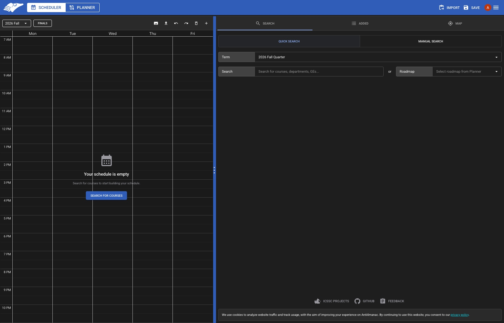
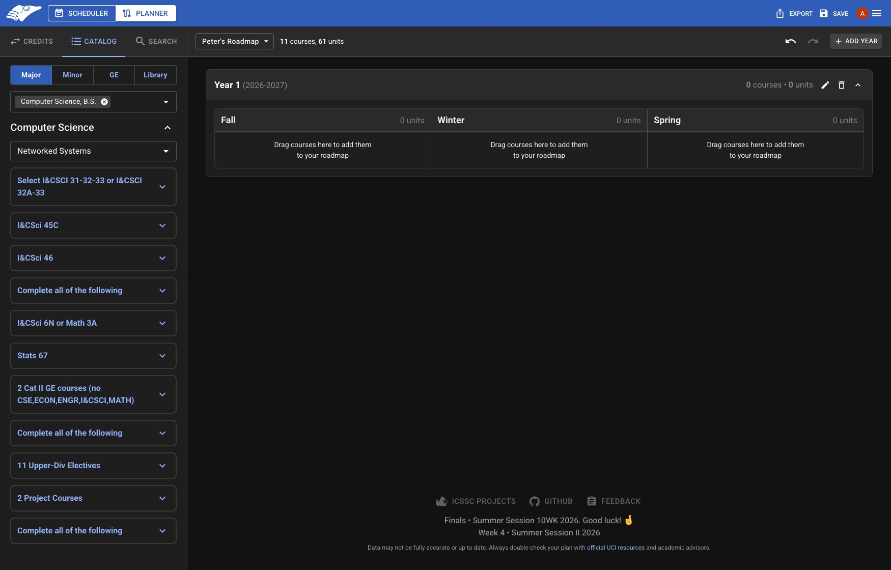

# About

AntAlmanac is a course-planning platform for courses at UC Irvine.
It includes two powerful planning tools: AntAlmanac Scheduler, for quarterly schedules, and AntAlmanac Planner, for multi-year roadmaps and course discovery.
Features include:

| AntAlmanac Scheduler                                              | AntAlmanac Planner                                                                                                                                |
| ----------------------------------------------------------------- | ------------------------------------------------------------------------------------------------------------------------------------------------- |
| **Search** for classes by department, section code, and keywords. | **Show requirements** for multiple majors and minors                                                                                              |
| **Preview** class times on the _integrated calendar_.             | **View completion** of your _major_, _specialization_, _minor_, and _GE_ requirements                                                             |
| **Quickly access** course statistics, reviews, and prerequisites. | **Import** your unofficial transcript via [StudentAccess](https://www.reg.uci.edu/access/student/transcript/?seg=U) to populate previous courses. |
| **Locate** your class locations on the _interactive map_.         | **Add credits** from any _transferred courses_, _AP exams_, and _GE/Elective credits_                                                             |
|                     |                                                                                                         |

## Technology

Our website is a Next.js application deployed on AWS using SST (Serverless Stack).
A summary of the libraries we use are listed below.

### Frontend

- Shared
    - [React](https://react.dev/) - Library to build dynamic, component-based UIs.
    - [Next.js](https://nextjs.org) - React framework with server-side rendering.
    - [Material UI (MUI)](https://mui.com/material-ui/) - React component library that implements Google's Material Design.
- Scheduler
    - [React Big Calendar](https://github.com/jquense/react-big-calendar) - React calendar component.
    - [Recharts](https://recharts.org/en-US) - React chart component.
    - [Leaflet](https://leafletjs.com) - Interactive JS maps.
    - [Zustand](https://docs.pmnd.rs/zustand/getting-started/introduction) - State management.
- Planner
    - [Redux](https://redux.js.org/) - State management.

### Backend

- [tRPC](https://trpc.io) - type-safe API access layer for the AntAlmanac API.
- [Anteater API](https://docs.icssc.club/docs/about/anteaterapi) - API maintained by ICSSC for retrieving UCI data.
- [Drizzle ORM](https://orm.drizzle.team/) - [high-performance](https://orm.drizzle.team/benchmarks) type-safe SQL-like access layer compatible with all major SQL dialects.
- [PostgreSQL](https://www.postgresql.org) - Relational database for storing user data and schedules.
- [Next.js Route Handlers](https://nextjs.org/docs/app/building-your-application/routing/route-handlers) - Server routes for Planner auth and API

### Tooling

- Shared
    - [SST](https://sst.dev) - Infrastructure as code framework for AWS deployment.
    - [TypeScript](https://www.typescriptlang.org) - JavaScript with type-checking.
- Scheduler
    - [Docker](https://www.docker.com) - Containerization for local database development.
    - [Vitest](https://vitest.dev) - Test runner.

## Repository Structure

This is a [pnpm](https://pnpm.io) monorepo:

- `apps/`
    - `aants/` — AANTS, the class notification service (AWS Lambda + SQS + SES) that watches WebSoc and emails users when a section's enrollment status changes.
    - `antalmanac/` — the main Next.js web application, unifying AntAlmanac Scheduler and AntAlmanac Planner.
    - `antalmanac-planner/` - AntAlmanac Planner frontend and backend
    - `antalmanac-scheduler/` - AntAlmanac Scheduler frontend and backend
        - `db/` - Drizzle schema, migrations, and the database client.
        - `types/` — shared internal TypeScript types.
    - `apps/ios` — the native iOS wrapper (Swift WebView + push notifications).
- `packages/anteater-api` — Anteater API types, client, and utilities.

## History

AntAlmanac (now AntAlmanac Scheduler) was created in 2018 by a small group of students under the leadership of @the-rango.
They formed an AntAlmanac club for ongoing development and, in 2019, @devsdevsdevs directed a massive rewrite of the codebase as project lead.

In 2020, AntAlmanac was adopted by the ICSSC Projects Committee.
Meanwhile, PeterPortal (now AntAlmanac Planner) was created by another team on the Projects Committee led
by @uci-mars, aiming to unify fragmented course information and long-term planning resources in one application.

In February 2026, AntAlmanac and PeterPortal unified into a single course-planning platform at [antalmanac.com](https://antalmanac.com).
This repository now powers both tools. The legacy [PeterPortal repository](htttps://github.com/icssc/peterportal-client) is available as a public archive.
Read more in the [merge announcement](https://docs.icssc.club/docs/about/antalmanac/merge).

ICSSC continues to provide funding, marketing, and engineering to support the growing number of users and open-source developers that make up our AntAlmanac Community.

Since then, the project has continued to evolve and grow with successive generations of projects committee members!

| Year           | Scheduler (_AntAlmanac_) Lead | Planner (_PeterPortal_) Lead |
| -------------- | ----------------------------- | ---------------------------- |
| 2018 - 2019    | @the-rango (founder)          |                              |
| 2019 - 2020    | @devsdevsdevs                 |                              |
| 2020 - 2021    | @devsdevsdevs                 | @uci-mars                    |
| 2021 - 2022    | @ChaseC99                     | @chenaaron3                  |
| 2022 - 2023    | @EricPedley                   | @ethanwong16                 |
| 2023 - 2024    | @EricPedley, @ap0nia          | @js0mmer                     |
| 2024 - 2025    | @MinhxNguyen7, @adcockdalton  | @Awesome-E                   |
| 2025 - 2026    | @alexespejo                   | @CadenLee2                   |
| 2026 - Present | @sicn4rf                      | @anthonyj33                  |

# Contributing

We welcome open-source contributions!

> Before contributing, please read [ICSSC's contributor guidelines](https://docs.icssc.club/docs/contributor/common/guidelines).

Here is a rough guide on how to contribute:

## Steps

1. Look through the [issue tracker](https://github.com/icssc/AntAlmanac/issues) to find an open issue (one that hasn't been assigned to anybody) or create your own that describes the problem you want to fix.
   Before starting work on an issue, please leave a comment expressing your interest and wait for a member of our team to assign it to you.
   This helps avoid duplicate work and ensures that your contribution is aligned with the project's goals.
2. [Fork the repository](https://docs.github.com/en/get-started/quickstart/fork-a-repo) or
   create a branch if you have the permission to do so.
3. [Setup your development environment](#development-environment)
4. Create a draft pull request with your new branch to track your progress.
5. Make any desired changes, commit, and push them. Repeat until the selected issue has been addressed.
6. Change the pull request from draft to open. If possible, request a review from a member of our team.
7. Wait for your pull request to get reviewed and address any requested changes.
   Repeat until your pull request is approved.
8. Once your PR is approved, a member of our team will merge it and your changes will appear on the live website shortly! 🥳

## Additional Help

If you ever need help, feel free to get in touch on the [ICSSC Projects Discord server](https://discord.gg/Zu8KZHERtJ).

# Development Environment

## Pre-requisites

1. Install `Node.js`. This allows you to run JavaScript on your computer (outside of a browser).
   The required version is pinned in the repo's `.nvmrc`, so a version manager can read it automatically (`nvm use` / `fnm use`).
   We recommend using any of the following version managers to easily switch between Node.js versions.
    - [nvm](https://github.com/nvm-sh/nvm) - Node-Version-Manager.
    - [fnm](https://github.com/Schniz/fnm) - Fast-Node-Manager.
    - [nvm-windows](https://github.com/coreybutler/nvm-windows)

    Otherwise, download the correct version from [the official website](https://nodejs.org/en/download).

2. Install `pnpm`, our package manager.
   The exact version we use is pinned in the [root `package.json`](./package.json) (the `packageManager` field).

    ```bash
    npm install --global pnpm
    ```

3. Install `Docker`. This is required to run the local PostgreSQL database.
    - [Docker Desktop](https://www.docker.com/products/docker-desktop) - Available for macOS, Windows, and Linux.

## Developing

### Quick Start

1. Clone the AntAlmanac repository or your fork.

    ```bash
    git clone https://github.com/icssc/AntAlmanac.git
    ```

2. Navigate to the root directory and install the dependencies.

    ```bash
    cd AntAlmanac && pnpm install
    ```

3. Start the local PostgreSQL database using Docker Compose.

    ```bash
    docker compose up -d --build
    ```

    This will start a PostgreSQL database with the port and credentials defined in `docker-compose.yml`.

4. Set up environment variables:
    - Copy `apps/antalmanac/.env.example` to `apps/antalmanac/.env` and fill in values.
    - Copy `apps/antalmanac-scheduler/db/.env.example` to `apps/antalmanac-scheduler/db/.env` (same `DB_URL` as above is fine).
    - For AANTS local runs, use `apps/aants/.env.example` as a template.

    (Optional) Also set up your own Google OAuth to be able to test features that require signing in such as leaving reviews or saving roadmaps to your account.
    Add the relevant variables/secrets to the .env file.

5. Run database migrations to set up the database schema.

    ```bash
    pnpm sched:db:migrate
    ```

6. Fetch the static data (course information, term data, etc.).

    ```bash
    pnpm get-data
    ```

7. Start the development server.

    ```bash
    pnpm dev
    ```

8. View the local website at the URL printed in your terminal (by default http://localhost:3000).
   As you make changes to the application, those changes will be automatically reflected on the local website with hot reloading.

### Additional Commands

- **Database Studio**: Open Drizzle Studio to view and manage your local database.

    ```bash
    pnpm sched:db:studio
    ```

    ```bash
    pnpm plan:db:studio
    ```

- **Generate Database Migrations**: After modifying the database schema, generate a new migration.

    ```bash
    pnpm sched:db:generate
    ```

    ```bash
    pnpm plan:db:generate
    ```

- **Run Tests**: Execute the test suite.
    ```bash
    pnpm test
    ```

### Notes

- For more detailed contributor documentation, see the [AntAlmanac docs](https://docs.icssc.club/docs/contributor/antalmanac-scheduler).

## Deployment

AntAlmanac is deployed to AWS using [SST (Serverless Stack)](https://sst.dev). The deployment process is automated and managed through the `sst.config.ts` file.

### Deployment Environments

- **Production**: Deployed to `antalmanac.com` (with a `www.antalmanac.com` alias)
- **Staging**: Each pull request gets a preview deploy at `staging-{PR_NUMBER}.antalmanac.com`
- **Shared staging**: `staging-shared.antalmanac.com` is a persistent environment for cross-team (Scheduler ⇄ Planner) integration testing; deployed manually

### Deploying to Production

> **Note**: Only maintainers with proper AWS credentials can deploy to production.

To deploy the production environment:

```bash
pnpm deploy
```

This command runs `sst deploy --stage production` which:

1. Builds the Next.js application
2. Deploys the infrastructure to AWS (Lambda, CloudFront, etc.)
3. Updates the live website at antalmanac.com

### Environment Variables

The variables below configure a full production/staging **deployment** and are set in your AWS environment or CI/CD pipeline.
**For local development you only need the variables in `apps/antalmanac/.env.example` and `apps/antalmanac-scheduler/db/.env.example`;**
anything tagged _(optional locally)_ — maps, analytics, and the Planner integration — can be left unset when running locally.

- Shared
    - `OIDC_ISSUER_URL` - OAuth issuer URL
    - `ANTEATER_API_KEY` - API key for Anteater API
- Scheduler
    - `DB_URL` - Database connection string
    - `MAPBOX_ACCESS_TOKEN` _(optional locally)_ - Mapbox API token for map features
    - `NEXT_PUBLIC_TILES_ENDPOINT` _(optional locally)_ - Endpoint for map tiles
    - `OIDC_CLIENT_ID` - OAuth client ID for Google authentication
    - `BETTER_AUTH_URL` - URL used for OAuth (automatically set based on stage)
    - `BETTER_AUTH_SECRET` - OAuth secret key, you can [generate one here](https://better-auth.com/docs/installation#set-environment-variables)
    - `NEXT_PUBLIC_BASE_URL` - Base URL of the site (automatically set based on stage)
    - `NEXT_PUBLIC_PUBLIC_POSTHOG_KEY` _(optional locally)_ - PostHog project key for product analytics
    - `PLANNER_CLIENT_API_KEY` _(optional locally)_ - API key for the AntAlmanac Planner integration
- Planner
    - `PUBLIC_API_URL` - Anteater API URL
    - `PRODUCTION_DOMAIN` - Domain for current deployment
    - `PLANNER_OIDC_CLIENT_ID` - OAuth client ID for Google authentication
    - `DATABASE_URL` _(optional locally)_ - Database connection string
    - `ADMIN_EMAILS` _(optional locally)_ - List of emails with access to administrative actions
    - `SESSION_SECRET` _(optional locally)_ - Secret key for session management
    - `EXTERNAL_USER_READ_SECRET` _(optional locally)_ - API key for external read-only access to user data

> ⚠️ Note: Anteater API requires a special API key in order for search functionality to work. If you'd like to work on a feature relating to this, please send a message in [our Discord](https://discord.gg/Zu8KZHERtJ).

# Troubleshooting

## `npm i -g <package>` fails

This is usually an issue with permissions because `npm` is trying to install a Node package
into a globally accessible location like `/bin`, which requires admin permissions.

The best way to resolve this is to install Node via a version manager to properly handle
these sorts of permissions:

- [nvm](https://github.com/nvm-sh/nvm) - Node-Version-Manager.
- [fnm](https://github.com/Schniz/fnm) - Fast-Node-Manager.
- [nvm-windows](https://github.com/coreybutler/nvm-windows)

A more convenient, but less secure way to resolve this is to run the command with admin privileges, e.g with `sudo`.

## The website doesn't seem to load at all

Try disabling your adblocker or browser extensions that might interfere with local development.

## I need environment variables!

Please reference the `.env.example` files provided.

If you need production credentials to access the production database or other private resources, please contact a project lead.

# Where Does the Data Come From?

We consolidate our data directly from official UCI sources such as: UCI Catalogue, UCI Public Records Office, and UCI WebReg (courtesy of [Anteater API](https://github.com/icssc/anteater-api)).

# Disclaimer

Although we consolidate our data directly from official UCI sources, this application is by no means an official UCI tool.
We strive to keep our data as accurate as possible with the limited support we receive from UCI.
Please take this into consideration while using the website.

# Terms & Conditions

There are no hard policies at the moment for utilizing this tool.
However, please refrain from abusing the website by methods such as: sending excessive amount of requests in a small period of time or purposely looking to exploit the system.
