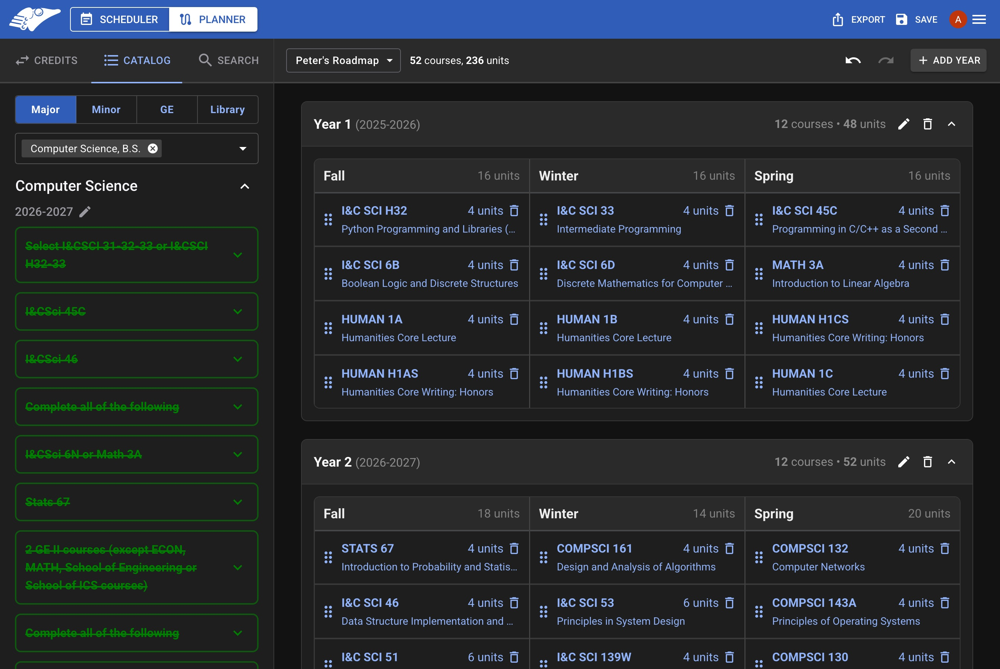

# About

AntAlmanac is a course-planning platform for courses at UC Irvine.
It includes two powerful planning tools: AntAlmanac Scheduler, for quarterly schedules, and AntAlmanac Planner, for multi-year roadmaps and course discovery.
Features include:

| AntAlmanac Scheduler                                              | AntAlmanac Planner                                                                                                                                |
| ----------------------------------------------------------------- | ------------------------------------------------------------------------------------------------------------------------------------------------- |
| **Search** for classes by department, section code, and keywords. | **Show requirements** for multiple majors and minors                                                                                              |
| **Preview** class times on the _integrated calendar_.             | **View completion** of your _major_, _specialization_, _minor_, and _GE_ requirements                                                             |
| **Quickly access** course statistics, reviews, and prerequisites. | **Import** your unofficial transcript via [StudentAccess](https://www.reg.uci.edu/access/student/transcript/?seg=U) to populate previous courses. |
| **Locate** your class locations on the _interactive map_.         | **Add credits** from any _transferred courses_, _AP exams_, and _GE/Elective credits_                                                             |
|                     |                                                                                                         |

## Development

You only need two things to run AntAlmanac: Docker and [Mise](https://mise.jdx.dev/).

Install Docker:
- Windows: [Docker Desktop](https://www.docker.com/products/docker-desktop/)
- macOS: [OrbStack](https://orbstack.dev/)
- Linux: `curl -fsSL https://get.docker.com | sudo sh`

Install Mise:
- Follow [Mise documentation](https://mise.jdx.dev/getting-started.html).

If you are a contributor outside of ICSSC, fork this repository and clone the fork's URL instead.

```bash
git clone https://github.com/icssc/AntAlmanac && cd AntAlmanac

mise trust
mise install
mise run setup
```

## Repository

```
apps/
  antalmanac/             Next.js app (routes and public assets for both products)
  antalmanac-scheduler/   Scheduler site, Drizzle database, and shared types
  antalmanac-planner/     Planner site, API, and types
  aants/                  Enrollment notification service
  ios/                    iOS wrapper
packages/
  anteater-api/           Anteater API client and types
```

## Contributing

1. Find or open an [issue](https://github.com/icssc/AntAlmanac/issues), comment that you want it, and wait to be assigned.
2. [Fork](https://docs.github.com/en/get-started/quickstart/fork-a-repo) the repository or create a branch if you have the permission to do so.
3. Setup your [development environment](#development)
4. Make any desired changes, commit, and push them.
5. Create a PR and mark it ready for review. A maintainer merges it.
6. Wait for your pull request to get reviewed and address any requested changes.
7. Once your PR is approved, a member of our team will merge it and your changes will appear on the live website shortly! 🥳

Read [ICSSC’s contributor guidelines](https://docs.icssc.club/docs/contributor/common/guidelines) before you start. Questions go to the [Projects Discord](https://discord.gg/Zu8KZHERtJ).

## Technology

Next.js and React, with MUI. Scheduler state uses Zustand; Planner state uses Redux. The API layer is tRPC, backed by the [Anteater API](https://docs.icssc.club/docs/about/anteaterapi), Drizzle, and PostgreSQL. AWS deploys are defined with SST. Tests run on Vitest.

## History

AntAlmanac started in 2018 with @the-rango. PeterPortal, now Planner, started on the same ICSSC Projects Committee with @uci-mars. In February 2026 the two products became one platform. The archived PeterPortal client is at [icssc/peterportal-client](https://github.com/icssc/peterportal-client). More of the story is in the [merge announcement](https://docs.icssc.club/docs/about/antalmanac/merge).

| Year         | Scheduler lead               | Planner lead |
| ------------ | ---------------------------- | ------------ |
| 2018–2019    | @the-rango (founder)         |              |
| 2019–2020    | @devsdevsdevs                |              |
| 2020–2021    | @devsdevsdevs                | @uci-mars    |
| 2021–2022    | @ChaseC99                    | @chenaaron3  |
| 2022–2023    | @EricPedley                  | @ethanwong16 |
| 2023–2024    | @EricPedley, @ap0nia         | @js0mmer     |
| 2024–2025    | @MinhxNguyen7, @adcockdalton | @Awesome-E   |
| 2025–2026    | @alexespejo                  | @CadenLee2   |
| 2026–present | @sicn4rf                     | @anthonyj33  |

## Where Does the Data Come From?

We consolidate our data directly from official UCI sources such as: UCI Catalogue, UCI Public Records Office, and UCI WebReg (courtesy of [Anteater API](https://github.com/icssc/anteater-api)).

Although we consolidate our data directly from official UCI sources, this application is by no means an official UCI tool.
We strive to keep our data as accurate as possible with the limited support we receive from UCI.
Please take this into consideration while using the website.

## Terms & Conditions

There are no hard policies at the moment for utilizing this tool.
However, please refrain from abusing the website by methods such as: sending excessive amount of requests in a small period of time or purposely looking to exploit the system.
