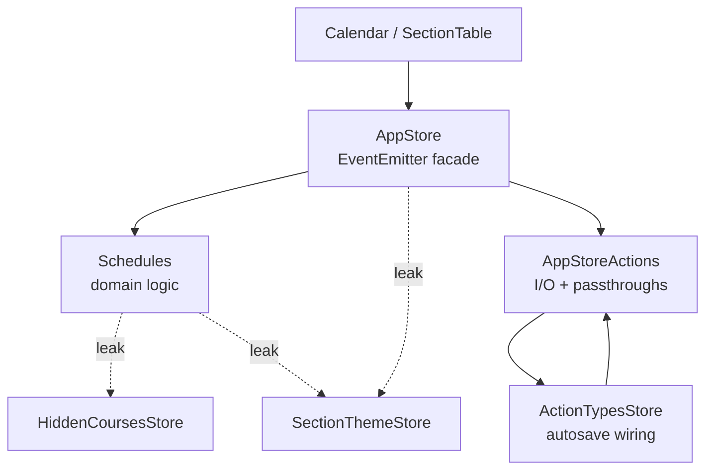
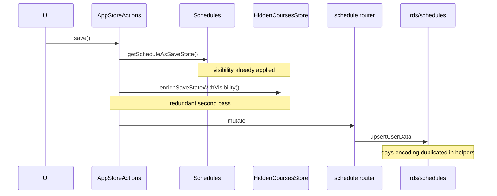
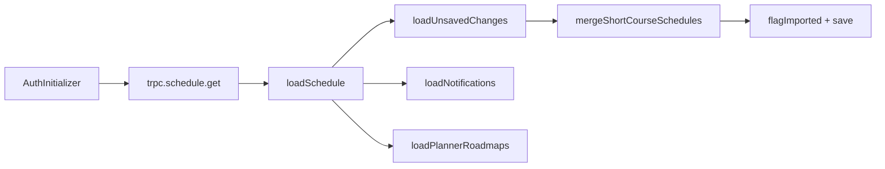

# Architecture Review — AntAlmanac

**Date:** June 28, 2026  
**Repo:** UC Irvine schedule planner monorepo (Next.js + tRPC + Zustand)  
**Branch:** `kwu/architecture-review-2534` (local only, not pushed)

> No `CONTEXT.md` or `docs/adr/` found — domain terms inferred from the codebase (Schedule, Section, Course, Search, Auth).

### Legend

| Symbol | Meaning |
|--------|---------|
| **module** | Anything with an interface and implementation |
| **seam** | Where a module's interface lives; behaviour can vary without editing callers |
| **leakage** | Coupling that crosses a seam |
| **deep module** | Small interface, large implementation |

---

## Candidates

### 1. Collapse the Schedule state triple-layer

**Strength:** Strong  
**Category:** in-process

**Files:** `AppStore.ts` · `Schedules.ts` · `AppStoreActions.ts` · `ActionTypesStore.ts` · `HiddenCoursesStore.ts` · `SectionThemeStore.ts`

#### Problem

Adding a Section bounces across four modules: `AppStore.addCourse` → `Schedules.addCourse` → `ActionTypesStore.autoSaveSchedule` → `autoSaveSchedule` in AppStoreActions. The rest of the app uses Zustand; schedule state still uses a singleton `EventEmitter` with manual `.on('addedCoursesChange')` subscriptions.

`AppStore` is largely a pass-through whose interface is nearly as wide as `Schedules` itself. ~15 exports in `AppStoreActions.ts` are one-liners (`deleteCourse`, `addSchedule`, `renameSchedule`, …).

#### Solution

One `useScheduleStore` (or similar) owning mutations, undo, save-state projection, and event subscription internally. Keep a thin `schedulePersistence.ts` only for tRPC I/O (save/load/import).

#### Benefits

- **Locality:** bugs concentrate in one module
- **Leverage:** one interface, N call sites
- **Tests hit one seam**
- Delete 15+ shallow passthrough exports

#### Before



**Mass diagram:** AppStore interface is nearly as tall as its implementation — shallow. Target: short interface bar, tall implementation bar.

#### After

```
┌─────────────────────────────────────┐
│  useScheduleStore (small interface) │
│  addSection · save · undo · subscribe│
├─────────────────────────────────────┤
│                                     │
│  Deep implementation                │
│  ↳ Schedules logic                  │
│  ↳ visibility projection            │
│  ↳ theme sync                       │
│  ↳ autosave debounce                │
│                                     │
└─────────────────────────────────────┘
         ╎ seam ╎
  schedulePersistence.ts — tRPC adapter only
```

**Deletion test:** Yes — deleting AppStore + AppStoreActions passthroughs would concentrate complexity into one schedule module. You'd lose indirection, not capability.

---

### 2. Own the Schedule persistence round-trip

**Strength:** Strong  
**Category:** ports & adapters

**Files:** `Schedules.ts` · `AppStoreActions.ts` · `AuthInitializer.tsx` · `backend/lib/rds/schedules.ts` · `backend/lib/rds/helpers.ts`

#### Problem

A full save/load cycle touches 6+ files. Visibility is applied twice at the save seam:

- `getScheduleAsSaveState()` in `Schedules.ts` already calls `getVisibility` internally
- `enrichSaveStateWithVisibility()` in `AppStoreActions.ts` applies it again before save

`fromScheduleSaveState` embeds async WebSOC fetching + offering grouping inside a store class — hydration bugs are hard to localize. Backend `aggregateUserData` re-implements custom-event `days` encoding (`boolean[]` ↔ `'1010100'`) that `upsertCustomEvents` inverts — encoding rules live on both sides of the seam.

#### Solution

A `SchedulePersistence` module with `toSaveState`, `fromSaveState`, `hydrateFromWebsoc`, `upsertToDb`, `loadFromDb` — one place for ID mapping, visibility, and custom-event encoding. Two adapters: HTTP in prod, in-memory in tests.

#### Benefits

- **Locality:** ID mapping and encoding rules in one module
- Delete redundant `enrichSaveStateWithVisibility`
- **Two adapters justify the seam**
- Hydration bugs become testable

#### Before



#### After

```
SchedulePersistence (deep module)
├── toSaveState(schedule, visibility)
├── fromSaveState(short, websocAdapter)
├── hydrateFromWebsoc(sections)
└── mapScheduleIds(idMap)

adapters: trpc.schedule (prod) · in-memory (tests)
```

**Deletion test:** Yes — deleting thin RDS router wrappers and merging aggregation into `schedules.ts` would concentrate persistence depth. Deleting `enrichSaveStateWithVisibility` entirely is safe (redundant).

**Test gap:** Zero tests under `backend/`; `fromScheduleSaveState`, `mergeShortCourseSchedules`, and `upsertCourses` dedup logic are untested.

---

### 3. Unify Section identity and color assignment

**Strength:** Strong  
**Category:** in-process

**Files:** `scheduleHelpers.ts` · `lib/sectionThemes/index.ts` · `SectionThemeStore.ts` · `HiddenCoursesStore.ts`

#### Problem

Two parallel color-assignment algorithms mirror the same offering/sectionType proximity rules (`getColorForNewSection` vs `pickCourseSlot`). Two key formats:

| Module | Key format | Example |
|--------|-----------|---------|
| `scheduleHelpers` | `term::sectionCode` | `2024 Fall::00100` |
| `sectionThemes` | `term\|sectionCode` | `2024 Fall\|00100` |

Consumers split keys: `HiddenCoursesStore`, `NotificationStore`, `CalendarRoot` use `scheduleSectionKey`; `ColorPicker`, `SectionTableBodyRowColorStrip` use `courseColorKey`. The codebase acknowledges this with a TODO in `sectionThemes/index.ts`.

Pure functions are tested for the legacy path (`scheduleHelpers.test.ts`) but `computeAssignments` / theme resolution have no tests.

#### Solution

Single `sectionIdentity.ts` exporting `sectionKey`, `offeringKey`, `assignColor(section, context, mode: 'custom' | 'themeId')` used by both add-course and theme stores.

#### Benefits

- **Locality:** color bugs in one module
- **Leverage:** one key format, all consumers
- Tests cover full assignment path

#### Before

```
scheduleHelpers          sectionThemes
─────────────────        ─────────────────
2024 Fall::00100         2024 Fall|00100
getColorForNewSection()  pickCourseSlot()
✓ tested                 ✗ untested
```

#### After

```
sectionIdentity.ts (deep module)
├── sectionKey(term, code) → one format
├── offeringKey(dept, num, type)
└── assignColor(section, ctx, mode)
```

**Deletion test:** Yes — deleting either color engine would force consolidation. Deleting `scheduleSectionKey` without merging would break multiple stores.

---

### 4. Deepen Course Search orchestration

**Strength:** Worth exploring  
**Category:** in-process

**Files:** `SearchParams/*` · `SearchForm/*` · `CourseRenderPane.tsx` · `RightPaneStore.ts` · `backend/routers/search.ts` · `websoc.ts`

#### Problem

To understand "what happens when I search?" you read: URL parsers → hooks → `CourseRenderPane` queryFn (GE intersection, multi-search offered-filter, planner filter) → tRPC websoc/search routers. `loaders.ts` is a shallow adapter over `nuqs`. `RightPaneStore` is a second state mechanism (EventEmitter) holding multi-search params outside URL state.

Search *behaviour* lives in a React component, not a testable module. No search tests exist.

#### Solution

`buildWebsocQuery(formData, multiSearch)` + `executeCourseSearch(query, trpc)` module; fold `RightPaneStore.multiSearchData` into URL state or the search store. `CourseRenderPane` becomes pure view.

#### Benefits

- **Interface is the test surface**
- Fold RightPaneStore into URL state
- Zero search tests today → many

#### Before (cross-section)

```
parsers.ts          ─┐
loaders.ts (shallow) │
hooks.ts             ├─ 6 thin layers
CourseRenderPane     │  ← behaviour lives here
RightPaneStore       │
tRPC websoc router  ─┘
```

#### After

```
courseSearch.ts (deep module)
├── parseSearchParams(url)
├── buildWebsocQuery(form, multiSearch)
└── executeSearch(query, trpcAdapter)

CourseRenderPane → pure view
```

**Deletion test:** Partially — deleting `loaders.ts` or `RightPaneStore` alone just moves lines. Collapsing `SearchParams/` into one `courseSearch/` module would concentrate depth.

---

### 5. Collapse Auth bootstrap into one module

**Strength:** Worth exploring  
**Category:** in-process

**Files:** `AuthInitializer.tsx` · `AppStoreActions.ts` · `localStorage.ts` · `localTempSaveDataHelpers.ts` · `lib/auth/*`

#### Problem

Post-login flow is a distributed saga with no single owner:

```
AuthInitializer → trpc.schedule.get → loadSchedule → loadUnsavedChanges
  → mergeShortCourseSchedules → flagImported + save → loadNotifications → loadPlannerRoadmaps
```

Import and unsaved-changes recovery duplicate `mergeShortCourseSchedules` logic in different call sites. Failures in merge ordering are hard to reproduce. Only `authUtils.test.ts` (redirect safety) exists — no tests for cache merge or import-on-login.

#### Solution

`sessionBootstrap.ts`: `authenticate → fetchSchedules → hydrate → recoverLocalCache → persistIfNeeded → loadSecondaryData(notifications, planner)`. `AuthInitializer` becomes a thin adapter.

#### Benefits

- **Locality:** bootstrap logic in one place
- **Leverage:** test each phase independently
- AuthInitializer becomes thin adapter

#### Before



#### After

```
sessionBootstrap.ts (deep module)
authenticate → fetchSchedules → hydrate → recoverLocalCache
  → persistIfNeeded → loadSecondaryData
```

**Deletion test:** Yes for `loadUnsavedChanges` as a separate concern — it should be a phase inside `bootstrapAuthenticatedSession()`, not embedded in a React effect.

---

### 6. Deepen backend RDS repositories

**Strength:** Worth exploring  
**Category:** local-substitutable

**Files:** `backend/lib/rds/*.ts` · `backend/routers/schedule.ts` · `lib/notifications.ts`

#### Problem

tRPC routers add almost no depth — e.g. `schedule.save` validates Zod then calls `upsertUserData`. Real complexity sits in `rds/schedules.ts` (conflict policies, delete-then-insert semantics, CUID mapping) but is completely untested. `lib/notifications.ts` is a shallow adapter whose only job is `serializeNotification` (term → year/quarter).

`friends.ts` exports 12 similar CRUD functions — interface surface as wide as implementation is shallow per function.

**Test coverage:** 12 frontend test files · 0 backend tests

#### Solution

Repository modules per aggregate (`ScheduleRepository`, `FriendshipRepository`) with Postgres + in-memory adapters. Two adapters justify each seam.

#### Benefits

- Interface shrinks per aggregate
- Upsert dedup becomes testable
- **Locality:** encoding rules in one module

#### Before

```
upsertUserData · upsertCourses · upsertCustomEvents · loadSchedules
aggregateUserData · 12× friendship CRUD
→ wide flat interface, zero tests
```

#### After

```
ScheduleRepository (deep)     FriendshipRepository (deep)
├── save / load / upsert      ├── request / accept / list / remove
adapters: Postgres · in-memory (tests)
```

**Deletion test:** No for routers alone (thin by design). Yes for splitting `rds/` into many one-function-per-file modules — merging into repository classes would add depth and test seams.

---

## Top recommendation

**[Candidate 1: Collapse the Schedule state triple-layer](#1-collapse-the-schedule-state-triple-layer)**

The Schedule domain is where the most cross-module navigation happens, where recent production bugs appeared at seams (schedule ID race, redundant visibility enrichment), and where the deletion test passes strongest. Deepening AppStore → Schedules → AppStoreActions into one Zustand module unlocks candidates 2 and 3 naturally — persistence and Section identity both leak through the current Schedule seams.

Also high-value: [Schedule persistence](#2-own-the-schedule-persistence-round-trip) · [Section identity](#3-unify-section-identity-and-color-assignment)

---

## What's not a strong candidate

- **`packages/types` + `packages/anteater-api`:** intentional adapter — Zod schemas wrap OpenAPI types with validation. Shallow but purposeful.
- **`term-section-codes.ts`:** small pure parser used by build scripts; fine as-is.
- **SectionTable cell components:** UI granularity, not architectural depth loss.

---

*Generated by the [improve-codebase-architecture](https://github.com/mattpocock/skills/blob/main/skills/engineering/improve-codebase-architecture/SKILL.md) skill.*
